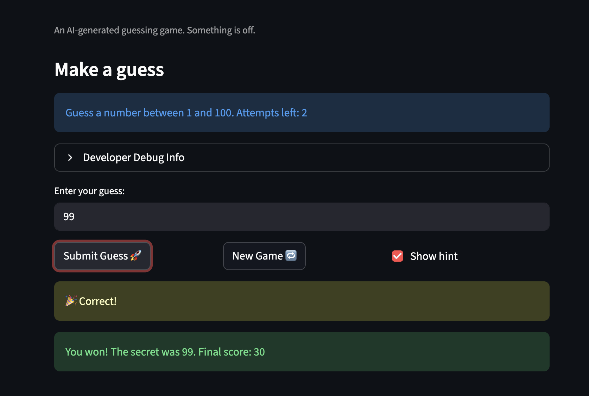

# 🎮 Game Glitch Investigator: The Impossible Guesser

## 🚨 The Situation

I was given an AI-generated "Number Guessing Game" built with Streamlit.
The AI wrote the code, but left it full of bugs and unplayable.

- I could not win.
- The hints were lying to me.
- The score was going negative.

## 🛠️ Setup

1. Install dependencies: `pip install -r requirements.txt`
2. Activate your virtual environment: `source venv/bin/activate`
3. Run the app: `python3 -m streamlit run app.py`

## 🕵️‍♂️ My Mission

1. **I played the game.** I opened the "Developer Debug Info" tab
   to see the secret number and observed the broken behavior.
2. **I found the bugs.** I noticed wrong hints, negative scores,
   out of range guesses being accepted, and broken logic.
3. **I fixed the logic.** I moved all functions into `logic_utils.py`
   and repaired each bug one by one.
4. **I tested my fixes.** I ran `python3 -m pytest` until all
   5 tests passed green.

## 📝 My Experience

**Game Purpose:**
I was debugging a number guessing game where the player guesses
a secret number between 1 and 100. The player gets hints after
each guess and has a limited number of attempts based on difficulty.

**Bugs I Found:**
- Bug 1: I noticed the High/Low hints were completely reversed.
  When I guessed 500 with a secret of 15, the game told me
  "Go HIGHER" instead of "Go LOWER."
- Bug 2: I discovered that every other guess converted the secret
  number to a string, causing random incorrect comparisons.
- Bug 3: I observed the score could go negative and even gain
  points for wrong guesses due to broken scoring logic.
- Bug 4: I found that Hard difficulty range was 1-50, which was
  actually easier than Normal difficulty at 1-100.

**Fixes I Applied:**
- I moved all logic functions into logic_utils.py
- I fixed check_guess() so High/Low hints are now correct
- I removed the even/odd string conversion bug from app.py
- I fixed update_score() so the score never goes below 0
- I fixed the Hard difficulty range to 1-200

## 📸 Demo

I fixed the game so it correctly shows "Go LOWER" when I guess
too high, "Go HIGHER" when I guess too low, and ends properly
when I win. My score stays positive and difficulty ranges are
now logical.

## ✅ Tests

I got all 5 pytest tests passing:
- test_winning_guess
- test_guess_too_high
- test_guess_too_low
- test_score_never_negative
- test_correct_hint_message

I ran them with: `python3 -m pytest`

## 🚀 Stretch Features

- [ ] [[Winning Game Screenshot]Screenshot within the files can't put it in ReadMe]
